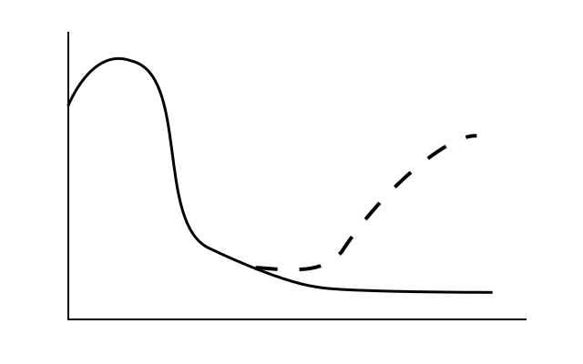

# Legacy Code

_(lightning edition)_

by That TDD Fellow

Oleksii Fedorov

[@waterlink000](https://twitter.com/waterlink000)

## What is legacy code?

Lets define _"legacy code"_ for the purpose of this talk.

- inherited code
- created by someone in the past
- (other programmers, company)

### .. or even yourself

### Slows down current development

- hard to understand
- have near to no test suite
- (or test suite is not helpful)

### Historic velocity

## What can we do about that?

### We should not blame anyone

### It is our responsibility to fix that

.. over time ..

.. one small step at a time ..

### "Big Refactoring Project" is not a solution

- business needs new features yesterday
- you will rush to complete that "Big Project"
- and will make another mess

## Problem A: Afraid to clean up

because it will break

### Solution: Rely on the test suite

### Problem B: There is no test suite

- or near to no test suite
- or it is not reliable

### Solution: Create this test suite

### But be LEAN about that

prioritize parts of legacy code (by frequency of change)

i.e.: when faced with new feature, that touches legacy code:

### Make change easy

i.e.:

- increase test coverage for related functionality
- clean up relevant code

### Then make an easy change

## Be faster one small step at a time

### While delivering increasing business value

## Thank you

Twitter: [twitter.com/waterlink000](https://twitter.com/waterlink000)

Github: [github.com/waterlink](https://github.com/waterlink)

Blog: [tddfellow.com](http://tddfellow.com)
